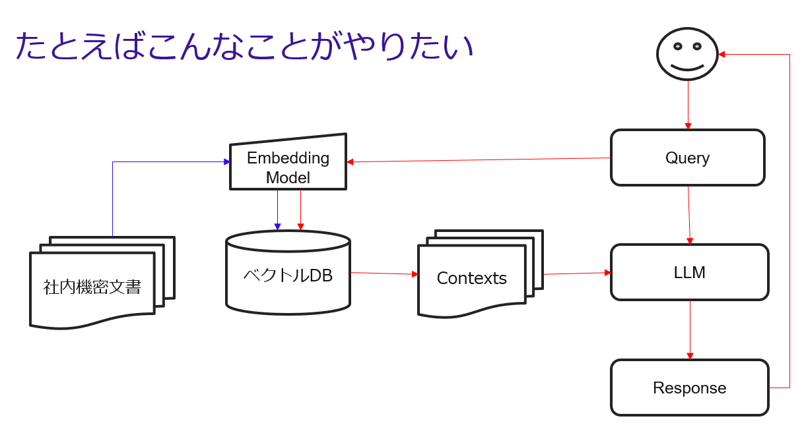

# LLM+RAG デモ用Notebook

以下2つのディレクトリがありますが、やっていることはほぼ同じです。

[./objectstore/](./objectstore/) 

データの保存先としてオブジェクトストレージを使用します。できればこちらを使ってください。

バケットの作成まで先に済ませておいて、各スクリプトの最初にある

```
accesskey = "LpkzPlUyAwDO2CQHE0XnW307GdqSJtms"
secretkey = "bUewoPAJnoKI2FhzJPYQnnFkLG-v382z"
endpoint = "http://10.38.76.10"
bucket = "langchain-bucket"
```
の部分を編集してください。


[./local_filesystem](./local_filesystem/)

データの保存先としてファイルシステム(~/dataディレクトリ)を使用します。

Kubernetes+KubeFlowの環境では、Notebook Serverのデプロイ時に `/home/jovyan/data` にボリュームをマウントしておくとよいです。

## デモシナリオ

こんな感じです。



## 使い方

以下の順番で実行してください。

1. extractor.ipynb (extractor_s3.ipynb)

    WebからHTMLを拾ってきて、テキストデータを抽出します。

2. vectorize.ipynb (vectorize_s3.ipynb)

    テキストデータをチャンク化したのち、Embeddingモデルを使って類似性検索のためのベクトルDBを作成します。

3. rag.ipynb (rag_s3.ipynb)

    ベクトルDBとLLMを使用して、RAGを実行します。

